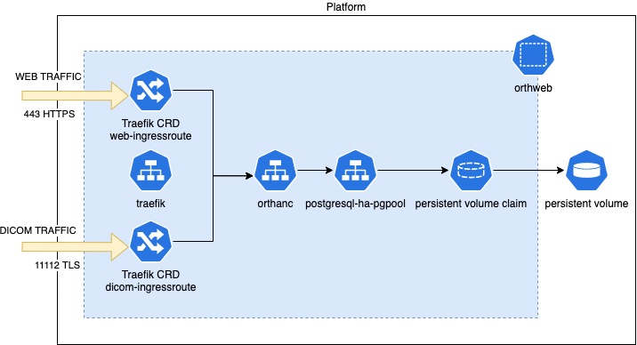

# Helm driven approach

In this approach, we deploy Orthanc with a single helm command, using the purpose-built Orthanc Helm Chart stored in the *orthanc* sub-directory. This chart is not released in a public Helm Repository. The content is simply stored in the local sub-directory. In order to deploy, we need to clone this repo first and enter the helm directory. Then we update dependency and install the chart:
```sh
$ git clone git@github.com:digihunch/korthweb.git
$ cd korthweb/helm
$ helm dependency update orthanc
$ helm install orthweb orthanc --create-namespace --namespace orthweb 
```
The installation is completed and you can monitor the pod status in the target namespace. 
If you need to uninstall it and remove persistent data, simply run:
```sh
helm -n orthweb uninstall orthweb && kubectl -n orthweb delete pvc -l app.kubernetes.io/component=postgresql 
```
Then the uninstall is done.

## Validation

Validation steps are nearly identical to those in the [manual](https://github.com/digihunch/korthweb/tree/main/manual#validation) approach, except that the TLS secret name may be different. First, find out the external IP address for traefik ingress:
```sh
kubectl -n orthweb get service orthweb-traefik -o jsonpath='{.status.loadBalancer.ingress[0].ip}'
```
Ensure that the DNS names web.orthweb.com and dicom.orthweb.com resolve to the external IP address of the traefik service. 

To validate web service:
```sh
kubectl -n orthweb get secret web.orthweb.com -o jsonpath='{.data.ca\.crt}' | base64 -d > ca.crt

curl -HHost:web.orthweb.com -v -k -X GET https://web.orthweb.com:443/app/explorer.html -u admin:orthanc --cacert ca.crt
```
You should see HTML content of the website. 

The steps to validate DICOM traffic is similiar to other deployment option. However, it is currently limited because dcmtk utility does not send SNI in the TLS negotiation.

I was able to test C-ECHO and C-STORE on annonymous tls (+tla) without client certificate.

```sh
echoscu -aet TESTER -aec ORTHANC -d +tla -ic dicom.orthweb.com 11112
storescu -aet TESTER -aec ORTHANC -d +tla -ic dicom.orthweb.com 11112 DICOM_CT/123.dcm
```


## Architecture
The *orthanc* Helm Chart automates a lot of activities, including the creation of certificates for the three FQDNs, installation of PostgreSQL using dependency chart, configuring the orthanc workload, and setting up an ingress for HTTP and DICOM traffic. 

The Helm Chart dependency tree looks like this

```bash
                     +--------------+
                     |              |
                     | Parent chart |
        +------------+   Orthanc    +-----------+
        |            |              |           |
        |            --------+------+           |
        |                                       |
        v                                       v
+-------+-------+                       +--------+------+
|               |                       |               |
|  Sub-chart    |                       |   Sub-chart   |
| PostgreSQL HA |                       |    Traefik    |
|               |                       |               |
+---------------+                       +---------------+
```

Once the Parent chart has been deployed, the required kubernetes objects (including the ones from the sub-charts) are all deployed and it may take a minute for the Pods to come to READY states. Below is an illustration of Kubernetes objects:



### Traefik CRD
We need to proxy both HTTP and TCP traffic, with the ability to terminate TLS traffic. Many Ingress technologies are good at the former. Traefik with CRD is also good at the latter. The CRDs are IngressRoute and IngressRouteTCP.

### Database
I included Postgresql-HA sub-chart to demonstrate the capability but in real life it is preferred to host database as a managed service provided by cloud platform. This chart also configures TLS connection between Orthanc Pods and PostgreSQL service. The certificate is stored as a Kubernetes Secret named db.orthweb.com.