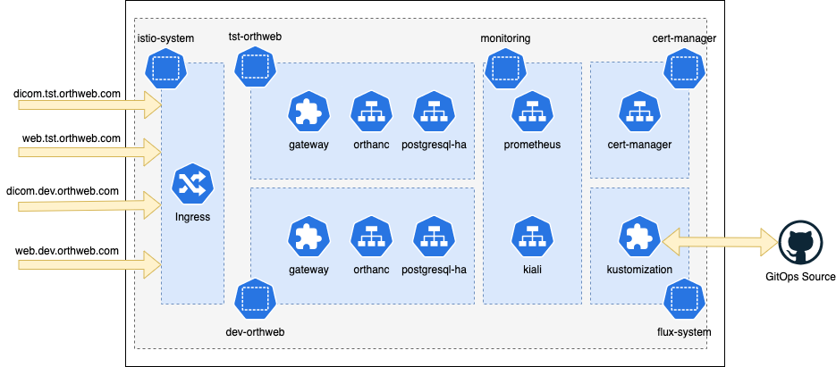

# Deploy Orthanc with GitOps using FluxCD

GitOps is the recommended approach to deploy Orthanc automatically. We use FluxCD as the GitOps tool. This approach also deploys Orthanc workload with two environments (dev and tst). At the end of deployment two instances are deployed, in the dev-orthweb and tst-orthweb namespaces, as illustrated below:



To work with this approach, we need a Kubernetes cluster, helm, kubectl and flux, and ensures that local kubectl connects to the cluster.
## Preparation
Fork this repo to your own GitHub account to use as the source of deployment. Then obtain your own Github Token and export it to environment variable GITHUB_TOKEN: 
```sh
export GITHUB_TOKEN=xxx_yyy55555XXXodr7ABBBB234CCccw
```
## Installation

First, we bootstrap the cluster. Suppose the name of your account is *digihunch*, and the repository name is korthweb, the command to run would be:

```sh
flux bootstrap github \
      --owner=digihunch \
      --repository=korthweb \
      --branch=main \
      --personal \
      --path=gitops/fluxcd
```
A deployment key will be created. FluxCD will be install on the cluster, and scans the path specified (gitops/fluxcd) for Kustomization objects.  Kustomization objects defines the sources to sync from. The sync should start automatically (using Kustomization objects) as boostrapping is completed. To check sync progress by kusomization status, run:
```sh
flux get ks --watch
```
It may take 10 minutes to sync all layers. At the end, the output should look like this:
```sh
NAME           	READY	MESSAGE                       	REVISION    	SUSPENDED
dev-application	True 	Applied revision: main/feffc67	main/feffc67	False
dev-dependency 	True 	Applied revision: main/feffc67	main/feffc67	False
flux-system    	True 	Applied revision: main/feffc67	main/feffc67	False
infrastructure 	True 	Applied revision: main/feffc67	main/feffc67	False
observability  	True 	Applied revision: main/feffc67	main/feffc67	False
tst-application	True 	Applied revision: main/feffc67	main/feffc67	False
tst-dependency 	True 	Applied revision: main/feffc67	main/feffc67	False
```

## Validation
The validation steps is the same as with the [manual](https://github.com/digihunch/korthweb/blob/main/manual/README.md#validation) approach in principal. The difference with the GitOps approach, is that there are two namespaces tst-orthweb and dev-orthweb, both of which need to be tested.

To validate the dev workload:
```sh
$ kubectl -n dev-orthweb get secret orthweb-secret -o jsonpath='{.data.ca\.crt}' | base64 --decode > ca.dev.crt
$ keytool -import -alias orthweb.com -file ca.dev.crt -storetype JKS -noprompt -keystore client.dev.truststore -storepass Password123!
$ curl -HHost:web.dev.orthweb.com -v -k -X GET https://web.dev.orthweb.com/app/explorer.html -u orthanc:orthanc --cacert ca.dev.crt
$ storescu -c ORTHANC@dicom.dev.orthweb.com:11112 --tls12 --tls-aes --trust-store client.dev.truststore --trust-store-pass Password123!
```

To validate the tst workload
```sh
$ kubectl -n tst-orthweb get secret orthweb-secret -o jsonpath='{.data.ca\.crt}' | base64 --decode > ca.tst.crt
$ keytool -import -alias orthweb.com -file ca.tst.crt -storetype JKS -noprompt -keystore client.tst.truststore -storepass Password123!
$ curl -HHost:web.tst.orthweb.com -v -k -X GET https://web.tst.orthweb.com/app/explorer.html -u orthanc:orthanc --cacert ca.tst.crt
$ storescu -c ORTHANC@dicom.tst.orthweb.com:11112 --tls12 --tls-aes --trust-store client.tst.truststore --trust-store-pass Password123!
```
To test C-STORE, use the storescu command with a dcm file as an additional argument. C-STORE will also test database write. C-STORE should come successful with a status code of 0 in C-STORE-RSP.

To check Pod logs, use Kiali. We can use port-forward to expose kiali service.
```sh
kubectl port-forward svc/kiali -n monitoring 8080:20001
```

## Troubleshooting

Once you fork from this repository and follow this guide, it should just work and every Kustomization should eventually come to ready status. 
In case of error, below is how I usually troubleshoot.

1. Examine status of each Kustomization. The following command is essentially the same as "fluxctl get ks":
```sh
kubectl -n flux-system get kustomization
```
The result may look like this where two kustomizations are waiting for health check results:
```
NAME              READY     STATUS                                                            AGE
dev-application   False     dependency 'flux-system/dev-dependency' is not ready              8m14s
dev-dependency    Unknown   running health checks with a timeout of 9m30s                     8m14s
flux-system       True      Applied revision: main/283db0a641d41637cfc9b6f0f13947d5849e4290   8m47s
infrastructure    True      Applied revision: main/283db0a641d41637cfc9b6f0f13947d5849e4290   8m14s
tst-application   False     dependency 'flux-system/tst-dependency' is not ready              8m14s
tst-dependency    Unknown   running health checks with a timeout of 9m30s                     8m14s
```
This state is normal for a short period of time but if it seems to take forever, we need to inspect the kustomizations pending for health check success.

2. Review the specific kustomization in question by describing the Kustomization:
```sh
kubectl -n flux-system describe kustomization tst-dependency | less
```
The output may include a section like below as Condition:
```
  Conditions:
    Last Transition Time:  2022-02-04T01:36:26Z
    Message:               Health check failed after 9m30.012342358s, timeout waiting for: [HelmRelease/tst-orthweb/postgres-ha status: 'InProgress': context deadline exceeded, Deployment/tst-orthweb/postgres-ha-postgresql-ha-pgpool status: 'NotFound': context deadline exceeded]
    Reason:                HealthCheckFailed
    Status:                False
    Type:                  Ready
    Last Transition Time:  2022-02-04T01:36:26Z
    Message:               HealthCheckFailed
    Reason:                HealthCheckFailed
    Status:                False
    Type:                  Healthy
```
The result suggests that Health check for a HelmRelease postgres-ha failed. 

3. Review the status of the specific HelmRelease releated to the failure:
```sh
kubectl -n dev-orthweb describe helmreleases postgres-ha | less
```
The result may show the following in Events:
```
Events:
  Type    Reason  Age   From             Message
  ----    ------  ----  ----             -------
  Normal  info    12m   helm-controller  HelmChart 'flux-system/dev-orthweb-postgres-ha' is not ready
  Normal  info    11m   helm-controller  Helm install has started
  Normal  error   11m   helm-controller  Helm install failed: YAML parse error on postgresql-ha/templates/postgresql/statefulset.yaml: error converting YAML to JSON: yaml: line 32: could not find expected ':'
  ```
  The error provides the detail of the reason for failure in the Helm Deployment.

4. You can also check the log of Flux:
```sh
flux logs
```